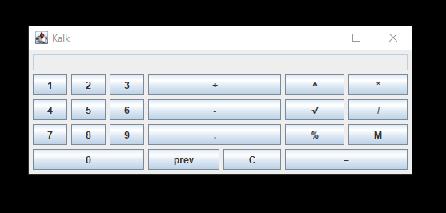

  # A simple calculator made in Java with the use of Swing library

### The Calculator

### Operations supported:
- Addition
- Subtraction
- Multiplication
- Division
- Power
- Root
- Percent
- Clear
- Cache number

